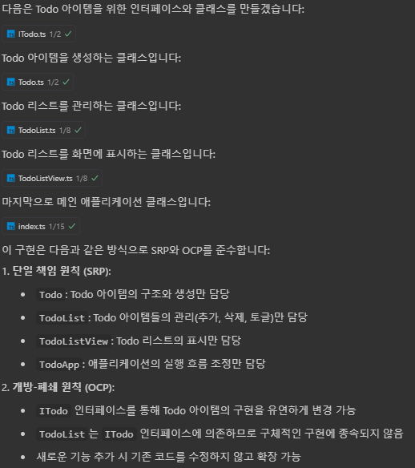

# NestJS를 이용한 SRP와 OCP 적용 및 GPT를 활용한 코드 구조 개선 방법 탐구

## **1. 주제**

소프트웨어 개발에서 **단일 책임 원칙(SRP)**과 **개방-폐쇄 원칙(OCP)**은 유지보수성과 확장성을 높이는 핵심 원칙입니다. 이번 발표에서는 **NestJS**를 이용한 백엔드 개발에서 이 두 가지 원칙을 어떻게 적용할 수 있는지, 그리고 **GPT**를 활용하여 코드 모듈을 작성하고 구조를 개선하는 방법을 탐구해보겠습니다.

---

## 2. **프로젝트 개요**

- **주제**
    - 할 일 관리(Todo) API 개발
- **프레임워크**
    - NestJS
- **기능 요구사항**
    
    **1. Todo 기본 관리 기능**
    
    - Todo 생성 (제목 입력)
    - Todo 삭제
    - Todo 완료/미완료 상태 토글
    - Todo 목록 조회
    
    **2. 데이터 저장소 옵션**
    
    - 메모리 저장소 (InMemoryTodoRepository)
    - API 저장소 (ApiTodoRepository)
    
    **3. 사용자 인터페이스**
    
    - 콘솔 기반 출력
    - 커스터마이즈 가능한 출력 포맷
    - 헤더
    - Todo 아이템 형식 ([X] 할일제목 (ID: xxx))

---

## 3. **코드 작성 및 분석 과정**

> ***Cursor를 활용하여 코딩 작성 및 피드백 과정 반복 적용***
> 

### 1차 코드 생성

<aside>
💡

**(SRP, OCP)을 적용해서 이를 준수하는 Todolist를 구현한 코드 모듈을 작성해줘!** 

</aside>



```
src
├── index.ts
├── interfaces
│   └── ITodo.ts
├── models
│   └── Todo.ts
├── services
│   └── TodoList.ts
└── views
    └── TodoListView.ts
```

```tsx
// src.services.TodoList.ts
import { ITodo } from '../interfaces/ITodo';
import { Todo } from '../models/Todo';

export class TodoList {
  private todos: ITodo[] = [];

  addTodo(title: string): ITodo {
    const todo = new Todo(title);
    this.todos.push(todo);
    return todo;
  }

  removeTodo(id: string): void {
    this.todos = this.todos.filter(todo => todo.id !== id);
  }

  toggleTodo(id: string): void {
    const todo = this.todos.find(todo => todo.id === id);
    if (todo) {
      todo.completed = !todo.completed;
    }
  }

  getTodos(): ITodo[] {
    return [...this.todos];
  }
}
```
- index.ts: 애플리케이션의 시작점에서 필요한 모듈과 클래스를 가져옵니다.
- ITodo.ts: Todo 객체의 구조를 정의합니다.
- Todo.ts: Todo 객체의 클래스와 관련된 메서드를 정의합니다.
- TodoList.ts: 여러 할 일을 관리하고 처리하는 서비스 계층입니다.
- TodoListView.ts: 할 일 목록을 화면에 렌더링하고, 사용자와의 상호작용을 처리합니다.

### 1차 피드백

<aside>
💡

다시 한 번 원칙들을 모두 잘 지키고 있는지 확인해봐바

</aside>


```tsx
// src.services.TodoList.ts
import { ITodo } from '../interfaces/ITodo';
import { ITodoRepository } from '../interfaces/ITodoRepository';
import { TodoFactory } from '../factories/TodoFactory';  // ✅ TodoFactory import

// SRP: ✅ Todo 비즈니스 로직 처리라는 단일 책임을 가짐
// OCP: ✅ 의존성 주입을 통해 저장소를 유연하게 교체 가능
export class TodoList {
  constructor(private repository: ITodoRepository) {}

  async addTodo(title: string): Promise<ITodo> {
    const todo = TodoFactory.createTodo(title);  // ✅ TodoFactory 사용
    return await this.repository.add(todo);
  }

  async removeTodo(id: string): Promise<void> {
    await this.repository.remove(id);
  }

  async toggleTodo(id: string): Promise<void> {
    const todo = await this.repository.findById(id);
    if (todo) {
      todo.completed = !todo.completed;
      await this.repository.update(todo);
    }
  }

  async getTodos(): Promise<ITodo[]> {
    return await this.repository.getAll();
  }
}

```

1. **의존성 주입 (Dependency Injection) 도입**
    
    **변화**
    
    - **기존 코드**: `TodoList` 클래스가 내부적으로 `todos` 배열에 직접 접근하여 상태를 관리했습니다.
    - **변경된 코드**: 생성자에서 `ITodoRepository` 인터페이스를 주입받아 저장소 역할을 위임했습니다.
    
    **이유**
    
    - **OCP 적용**: 저장소(repository)를 유연하게 교체할 수 있도록 설계되었습니다. 예를 들어, 나중에 로컬 배열 대신 **데이터베이스나 API와 연동된 저장소**로 쉽게 변경할 수 있습니다.
    - 테스트할 때 **모의 객체(mock)**를 주입하여 더 쉽게 단위 테스트를 작성할 수 있습니다.

---

1. **`TodoFactory` 사용으로 객체 생성 분리**
    
    **변화**
    
    - **기존 코드**: `addTodo` 메소드에서 `new Todo()`로 객체를 직접 생성했습니다.
    - **변경된 코드**: `TodoFactory.createTodo(title)`로 객체 생성 책임을 별도의 팩토리로 분리했습니다.
    
    **이유**
    
    - **SRP 적용**: `TodoList` 클래스는 객체 생성 책임까지 가지면 복잡해지므로, 이를 **팩토리 클래스(TodoFactory)**로 위임했습니다. 이렇게 하면 **TodoList**는 비즈니스 로직에만 집중할 수 있습니다.
    - 팩토리를 사용하면 **Todo 객체의 생성 과정**이 복잡해져도 변경 사항이 **팩토리 내부**에만 영향을 미치고, `TodoList`는 그대로 유지됩니다.

---

1. **비즈니스 로직과 저장소 로직 분리**
    
    **변화**
    
    - **기존 코드**: `this.todos` 배열에서 직접 데이터를 관리하고 수정했습니다.
    - **변경된 코드**: 저장소(repository)에 `add`, `remove`, `findById`, `update` 같은 메서드를 호출하여 저장소가 데이터를 관리하도록 했습니다.
    
    **이유**
    
    - **SRP 적용**: `TodoList` 클래스는 **비즈니스 로직 처리**라는 단일 책임만 가지게 되어 더 깔끔하고 유지보수가 쉬워졌습니다.
    - 데이터의 조회, 추가, 삭제 등의 작업은 **저장소에 위임**함으로써, 저장 방식이 바뀌더라도 **비즈니스 로직과 데이터 처리 로직이 분리**되어 영향을 덜 받습니다.

### 2차 피드백

<aside>
💡

**이제 이 프로젝트에서는 더 SRP나 OCP어기는 거 없어? 한 번 더 검토하고 있다면 수정해줘**

</aside>


```tsx
// src.services.TodoList.ts
import { ITodo } from '../interfaces/ITodo';
import { ITodoRepository } from '../interfaces/ITodoRepository';
import { TodoFactory } from '../factories/TodoFactory';  // ✅ TodoFactory import
import { ITodoStateManager } from '../interfaces/ITodoStateManager';

// SRP: ✅ Todo 비즈니스 로직 처리라는 단일 책임을 가짐
// OCP: ✅ 의존성 주입을 통해 저장소를 유연하게 교체 가능
export class TodoList {
  constructor(
    private repository: ITodoRepository,
    private stateManager: ITodoStateManager
  ) {}

  async addTodo(title: string): Promise<ITodo> {
    const todo = TodoFactory.createTodo(title);  // ✅ TodoFactory 사용
    return await this.repository.add(todo);
  }

  async removeTodo(id: string): Promise<void> {
    await this.repository.remove(id);
  }

  async toggleTodo(id: string): Promise<void> {
    const todo = await this.repository.findById(id);
    if (todo) {
      this.stateManager.toggleState(todo);
      await this.repository.update(todo);
    }
  }

  async getTodos(): Promise<ITodo[]> {
    return await this.repository.getAll();
  }
}

```

1. **ITodoStateManager 도입으로 상태 관리 책임 분리**
    
    **변화**
    
    - **기존 코드**: `toggleTodo` 메서드 내에서 직접 `todo.completed` 상태를 반전시켰습니다.
    - **변경된 코드**: **`ITodoStateManager`*를 주입받아 상태 변경을 `stateManager.toggleState(todo)`로 위임했습니다.
    
    **이유**
    
    - **SRP 적용**:
        - 첫 번째 코드에서는 **TodoList**가 상태 변경까지 직접 처리했지만, 상태 관리도 하나의 별도 책임이 될 수 있습니다.
        - `ITodoStateManager`를 도입함으로써 **TodoList 클래스의 역할을 비즈니스 로직에만 집중**하게 만들고, 상태 관련 로직을 외부로 분리했습니다.
    - **유연한 확장성**:
        - 상태 변경 로직이 나중에 더 복잡해지거나 다양한 상태가 추가될 경우, 이를 **`ITodoStateManager`에서 집중적으로 관리**할 수 있습니다.
        - 예를 들어, 상태 변경 시 로그를 기록하거나 상태 전환 제약 조건을 두는 경우에도 **TodoList 클래스의 수정 없이** 쉽게 확장할 수 있습니다.

---

1. **의존성 주입 (Dependency Injection)으로 유연성 강화**
    
    **변화**
    
    - **기존 코드**: `TodoList`는 **저장소(repository)**만 의존성으로 주입받았습니다.
    - **변경된 코드**: `TodoList`는 **저장소(repository)**와 **상태 관리자(stateManager)** 두 가지 의존성을 주입받습니다.
    
    **이유**
    
    - **OCP 적용**: `TodoList`는 상태 관리 방식이나 저장소 구현체가 바뀌더라도 **코드를 수정하지 않고** 의존성 주입만으로 새로운 구현체를 사용할 수 있습니다.
    - 단위 테스트 시 **Mock된 ITodoStateManager**를 주입해 **상태 관리 로직을 별도로 검증**할 수 있습니다.

---

1. **상태 변경 로직의 복잡성 처리**
    
    **변화**
    
    - **기존 코드**: 상태 변경이 단순해서 `todo.completed = !todo.completed` 코드로 처리했습니다.
    - **변경된 코드**: 상태 관리의 책임을 **`stateManager`*가 담당하여 `toggleState(todo)`로 변경했습니다.
    
    **이유**
    
    - 상태 변경이 단순한 경우에는 `todo.completed = !todo.completed`로 충분할 수 있지만, **복잡한 상태 변경**이 필요한 경우에는 별도의 상태 관리자에서 이 로직을 처리하는 것이 더 좋습니다.
        - 예를 들어, 상태 변경 시 추가적인 검증, 알림 전송, 로그 기록 등이 필요할 때 유용합니다.
        - 상태 전환 제약(예: 특정 조건에서만 상태를 변경)을 추가할 때 **상태 관리자**에서 처리하는 것이 더 깔끔합니다.

---

## 4.

```tsx
import { ITodo } from '../interfaces/ITodo';
import { ITodoRepository } from '../interfaces/ITodoRepository';
import { ITodoStateManager } from '../interfaces/ITodoStateManager';
import { 
  AddTodoCommand, 
  RemoveTodoCommand, 
  ToggleTodoCommand, 
  GetTodosCommand 
} from '../commands/TodoCommands';

export class TodoList {
  constructor(
    private repository: ITodoRepository,
    private stateManager: ITodoStateManager
  ) {}

  async addTodo(title: string): Promise<ITodo> {
    const command = new AddTodoCommand(title, this.repository);
    return await command.execute();
  }

  async removeTodo(id: string): Promise<void> {
    const command = new RemoveTodoCommand(id, this.repository);
    await command.execute();
  }

  async toggleTodo(id: string): Promise<void> {
    const command = new ToggleTodoCommand(
      id, 
      this.repository, 
      this.stateManager
    );
    await command.execute();
  }

  async getTodos(): Promise<ITodo[]> {
    const command = new GetTodosCommand(this.repository);
    return await command.execute();
  }
}

`
```